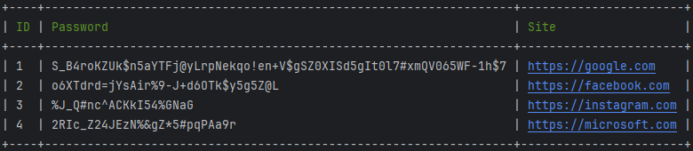

# PasswordGen

PasswordGen é uma aplicação de linha de comando (CLI) para gerar, armazenar, listar, atualizar e excluir senhas em um banco de dados SQLite. Ele utiliza o Symfony Console para gerenciar comandos e o PDO para interagir com o banco de dados.

## Funcionalidades

- **Gerar Senhas**: Crie senhas seguras para diferentes sites.
- **Armazenar Senhas**: Salve as senhas geradas no banco de dados.
- **Listar Senhas**: Exiba todas as senhas armazenadas.
- **Atualizar Site**: Atualize o nome do site associado a uma senha.
- **Excluir Senhas**: Remova senhas do banco de dados.
- **Migração de Banco de Dados**: Configure automaticamente o banco de dados e as tabelas necessárias.

## Requisitos

- PHP 8.3 ou superior
- Composer
- Driver SQLite instalado
- Extensão PDO habilitada

## Instalação e configuração

1. Clone o repositório:
   ```bash
   git clone https://github.com/hptsilva/PasswordGen.git
   cd PasswordGen
   ```

2. Instale as dependências com o Composer:
    ```bash
   composer install
   ```

3. Configure o arquivo .env: Copie o arquivo .env.example para .env e preencha as informações do banco de dados:
    ```bash
   cp .env.example .env
   ```

4. Faça as migrações usando o comando:
    ```bash
   php password migrate
   ```

## Uso
Comandos disponíveis:
- Listar todas as senhas.
```php
php password show
```

- Gerar senha. Insira o tamanho da senha e o nome do site.
```php
php password generate <length> <site>
```
- Alterar site. Insira o novo site e o ID correspondente.
```php
php password update <id> <site>
```
- Deletar uma senha. Insira o ID da senha que deseja excluir.
```php
php password delete <id>
```

